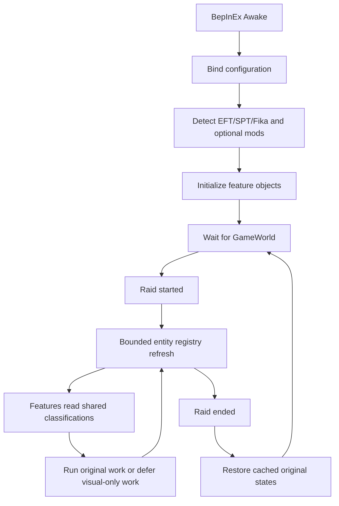

# Architecture and maintainer map

This document describes version 1.0's responsibilities and safety boundaries. It is intended for the next maintainer, not as a performance claim. The suite has four independently deployable assemblies; installing one does not silently turn another process into a client, server, or raid authority.

## Process model

| Process | Assembly | Responsibility | Can directly change raid FPS? |
|---|---|---|---|
| EFT client | `TarkovPerformanceSuite.dll` | Runtime presentation budgets, compatibility, profiler, HUD | Yes |
| EFT client or Fika headless | `TarkovPerformance.Loading.dll` | Loading settings, loading-stage reports, guarded loading experiments | Only indirectly; its work is primarily outside raids |
| SPT server | `TarkovPerformance.LoadingServer.dll` | Server startup/request measurements, thread-pool floor, optional fast HTTP compression | No; it can affect startup and response latency |
| Build/tests | `TarkovPerformance.Core.dll` | Unity-free algorithms, serialization, safety primitives | No |

Normal offline SPT uses the first two assemblies in one EFT process. In Fika, a client and a headless process each load their own copies. The SPT server component never renders a frame and does not own bot combat simulation.

## Source layout

```text
src/
|-- TarkovPerformance.Core/
|   |-- Diagnostics/          rolling statistics and report serialization
|   |-- Features/             safety primitives and reversible-feature contract
|   `-- Utilities/            version and method-signature checks
|-- TarkovPerformance.Plugin/
|   |-- Configuration/        BepInEx entries and named preset definitions
|   |-- Core/                 raid lifecycle and runtime information
|   |-- Diagnostics/          optional overlay, benchmarker, method/thread profiler
|   |-- Features/             one runtime feature per file
|   `-- FikaAdapter/          cached reflection; no Fika assembly reference
|-- TarkovPerformance.Loading/
|   `-- Plugin.cs             client/headless loading lifecycle and guarded patches
`-- TarkovPerformance.Server/
    |-- Configuration/        JSON configuration model
    |-- Diagnostics/          request timing state
    |-- Lifecycle/            SPT dependency-injection checkpoints
    |-- Patches/              independently reviewable HTTP Harmony patches
    |-- ModMetadata.cs
    `-- ServerLoadingRuntime.cs
```

The loading plugin is still the largest remaining file. Its nested snapshots must remain coupled to the plugin because they capture private BepInEx/Unity state. Its public patch groups are candidates for a future mechanical file split after integration tests cover each target.

## Runtime flow



`Plugin.Update` is the coordinator. Features do not independently scan the entire scene when shared entity information is available. `RaidLifecycle` decides when feature state may be allocated or restored. Disabling the master toggle calls every feature's `SetEnabled(false)` path immediately.

## Safety classification

`EntityRegistry` is the shared source of entity identity, distance, visibility, and baked-occlusion state. `RuntimeEntityClassifier` converts live EFT signals into the Unity-free `EntityClassifierLogic` model.

The important policy is conservative:

1. The local player is always protected.
2. Unknown entities fail open and keep EFT's original behavior.
3. Recently visible, nearby, or recently fighting entities receive stricter protection. There is currently no universal boss/special-faction exemption: the bot-counter HUD can label those roles, but presentation features generally classify a verified bot as `RemoteAI`.
4. Offline-authoritative bots are excluded from the Fika-observed-player update suppression path.
5. Only presentation work may be deferred. Damage, ballistics, inventory, movement authority, networking, and AI decisions are not intentional targets.

This policy is why Fika/headless clients may see a larger gain than offline SPT: a Fika client has many observed remote players whose visual interpolation and presentation can be budgeted. An offline client simulates authoritative bot AI locally, and this suite deliberately does not suppress that logic.

## Feature ownership and rollback

| Feature | Changes | Original state | Failure behavior |
|---|---|---|---|
| `RemoteUpdateBudgetFeature` | Retired; no player/weapon update patches are installed | None | Always preserves vanilla player and observed-player updates |
| `CombatPresentationBudgetFeature` | Reduces distant/occluded muzzle, impact, light, casing, and fly-by presentation | Patch decisions only | `FirearmController.InitiateShot` is never patched or skipped |
| `AreaLightCommandCacheFeature` | Reuses ambient-light commands for a bounded number of frames | Per-camera refresh state | Missing target or exception runs original |
| `RemoteAiOffscreenSkinningFeature` | Changes `updateWhenOffscreen` | `OriginalStateCache` per renderer | Full restore on disable/raid end |
| `RemoteCharacterShadowFeature` | Changes renderer shadow mode | `OriginalStateCache` per renderer | Full restore on disable/raid end |
| `CosmeticDeclutterFeature` | Sets `forceRenderingOff` for selected decorations | `OriginalStateCache` per renderer | Incremental scan and full restore |
| `WorldPresentationRateFeature` | Rate-limits selected world presentation updates | Patch decisions only | Missing/mismatched targets remain unpatched |
| `AggressiveQualityFeature` | Changes process-wide Unity quality settings | `QualitySnapshot` | Full restore on shutdown or disable |
| `FramePacingFeature` | Changes frame pacing values | `FramePacingSnapshot` | Full restore |
| `PipScopeOptimizationFeature` | Changes PiP render scale/toggle behavior | Per-camera state | Full-resolution PiP remains available |
| `DynamicMapsCompatibilityFeature` | Changes optional map refresh configuration through reflection | Captured reflected values | No Dynamic Maps assembly means no action |
| `OptimizedBotCounterFeature` | Draws cached counts from `EntityRegistry` | No game-state mutation | HUD may be disabled independently |
| `HeadlessAuthorityFeature` | Experimental bot snapshot/navigation pacing | Captured original interval/batch values | Disabled by default pending independent bot-combat validation |

## Harmony patch policy

Every runtime patch should follow these rules:

- Keep the target resolver next to the patch decision or name both explicitly.
- Verify the target type, parameters, return type, and known method fingerprint when feasible.
- Inspect existing Harmony owners and expose conflicts in diagnostics.
- Prefixes must return `true` unless the suite can prove its replacement is applicable.
- Never swallow an exception from gameplay authority code. Fail open to the original implementation.
- Document why skipping the original is safe, not merely what the prefix returns.
- Add a circuit breaker to repeated hot-path failures instead of logging every frame.

Diagnostic timing patches are installed only when enabled. They record inclusive and self time using per-thread stacks. The profiler itself has overhead and is not evidence of a production gain unless the same raid is repeated with profiling disabled.

## Threading boundary

Unity objects are not generally thread-safe. `Transform`, `GameObject`, `Renderer`, cameras, scenes, and EFT controllers stay on Unity's main thread. Work is moved off-thread only when its inputs are immutable or independent:

- benchmark file serialization receives an immutable sample array;
- diagnostic reports copy data before background I/O;
- process-thread sampling uses operating-system counters;
- loading resource classification operates on independent read-only keys and fails back to EFT on any exception;
- loading loot serialization is used only for independent loot trees and fails back to EFT;
- server reporting snapshots its bounded concurrent request queue.

Adding `Task.Run` around Unity work is not an optimization. It introduces races and can make loading or combat nondeterministic.

## Optional dependency policy

The runtime plugin has no compile-time Fika, Dynamic Maps, SAIN, or Questing Bots dependency. Optional integrations use assembly discovery plus cached reflection. Absence must result in `IsAvailable == false` or a no-op, never a startup error. PiP-Disabler is the exception: its separately licensed binary is packaged as an optional companion rather than copied into suite source.

## Configuration flow

`PluginConfiguration` declares entries. `PerformancePresetApplier` owns all values changed by named presets. The main plugin temporarily disables `SaveOnConfigSet`, applies the complete group, restores the setting, and saves once. Manual changes outside diagnostics/HUD/general sections switch the preset to `Custom`. Feature objects receive live values through `ApplyDynamicConfiguration` without requiring a game restart unless EFT itself owns the immutable setting.

## How to add a feature

1. Prove the hot path with a report and retain the evidence.
2. State whether the work is gameplay authority or presentation. Do not proceed if the distinction is unknown.
3. Implement `IPerformanceFeature` in one focused file.
4. Capture every mutated original value before the first change.
5. Make `SetEnabled(false)`, `OnRaidEnded`, and `Shutdown` idempotent.
6. Fail open when a target, dependency, or safety signal is missing.
7. Add counters that prove the feature actually runs without per-frame allocations.
8. Add core tests for extracted decisions and an integration checklist for EFT-only behavior.
9. Document conflicts and third-party provenance before publishing.

## Known architectural debt

- Runtime Harmony features need integration tests with stubbed patch targets; current automated tests cover only the Unity-free core and config persistence.
- `TarkovPerformance.Loading/Plugin.cs` should be split after tests lock down its patch targets and rollback behavior.
- Obfuscated EFT type names make source-level intent difficult to verify across updates. Fingerprints and runtime target reports must be refreshed for every supported EFT build.
- Performance evidence currently comes from two systems and uncontrolled raids. It is useful experimental evidence, not a universal benchmark.
